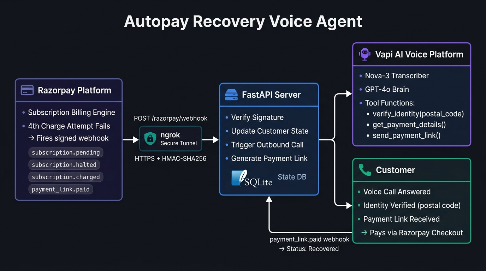

# Autopay Recovery Voice Agent

An AI voice agent that calls customers the moment their Razorpay autopay fails, verifies their identity, and either collects payment via a secure link or schedules a callback — all without human involvement.

Built with FastAPI, Vapi, Razorpay, and Deepgram Nova-3.

---

## Architecture



**Event flow:**

1. Razorpay autopay charge fails → subscription moves to `pending` or `halted`
2. Razorpay fires a signed webhook to `/razorpay/webhook`
3. Server verifies HMAC-SHA256 signature, maps `notes.customer_id` to a customer record, and dials the customer via Vapi
4. Vapi calls the customer using the Riya voice assistant (GPT-4o + Deepgram Nova-3 + Naina voice)
5. During the call, Riya invokes server-side tools over `/vapi/webhook`:
   - `verify_identity` — checks the billing postal code (max 2 attempts)
   - `get_payment_details` — returns amount, plan, failure reason, due date
   - `send_payment_link` — creates a Razorpay payment link and emails it
   - `log_outcome` — records the call result (`link_sent`, `promised_date`, `disputed`, `do_not_call`)
   - `escalate_to_human` — flags the account for human follow-up
6. If the customer pays via the emailed link, `payment_link.paid` webhook marks them as `recovered`
7. The live dashboard at `/` polls every 3 seconds and shows the status of all 10 demo customers

---

## Setup

```bash
python -m venv .venv
.venv\Scripts\activate          # Windows
pip install -r requirements.txt
npm install
cp env.example .env             # fill in all values
uvicorn main:app --port 8000
```

In a second terminal:
```bash
ngrok http 8000
```

Update `PUBLIC_URL` in `.env` with the ngrok HTTPS URL, then restart uvicorn.

```bash
python create_assistant.py      # creates/updates the Vapi assistant, prints VAPI_ASSISTANT_ID
```

Paste the printed ID into `.env` as `VAPI_ASSISTANT_ID`, then restart uvicorn again.

Open **http://localhost:8000** to see the dashboard.

---

## Razorpay Webhook Setup

In **Razorpay Dashboard → Account & Settings → Webhooks**:

- URL: `https://<your-ngrok-subdomain>.ngrok-free.app/razorpay/webhook`
- Secret: same value as `RAZORPAY_WEBHOOK_SECRET` in `.env`
- Events to enable: `subscription.pending`, `subscription.halted`, `subscription.charged`, `payment_link.paid`

---

## Creating Test Subscriptions

```bash
python seed_razorpay.py 1       # creates a subscription for customer #1 (Aarav Mehta)
python seed_razorpay.py 1 2 3   # creates subscriptions for customers 1, 2, 3
```

Each command prints a subscription ID and an authentication link. Open the link and pay once with a Razorpay test card to activate the subscription.

To trigger the voice agent:
1. Go to **Razorpay Dashboard → Subscriptions**, open the subscription
2. Click **Charge this now** → choose **Charge as Failure** (repeat until the subscription moves to `pending` — usually on the 3rd failed attempt)
3. The webhook fires, the server marks the customer as `payment_failed`, and Vapi calls your phone

---

## Simulating Without Razorpay

```bash
python simulate_webhook.py 1    # fires a subscription.pending event for customer #1
```

This signs and posts the webhook payload directly to `localhost:8000/razorpay/webhook`, bypassing Razorpay entirely. Useful for demos or local testing.

---

## Files

| File | Purpose |
|---|---|
| `main.py` | FastAPI app — dashboard API, Vapi webhook handler, tool dispatch, payment link creation, Razorpay webhook |
| `db.py` | SQLite store and 10 fictional demo customers |
| `create_assistant.py` | Creates or updates the Vapi assistant with the system prompt and all tool definitions |
| `seed_razorpay.py` | Creates Razorpay test plans and subscriptions for chosen customers |
| `simulate_webhook.py` | Simulates a Razorpay `subscription.pending` webhook locally |
| `mailer.js` | Sends the payment link email via Nodemailer (SMTP) |
| `static/index.html` | Live operator dashboard — auto-refreshes every 3 seconds |
| `env.example` | Template for all required environment variables |

---

## Environment Variables

| Variable | Required | Description |
|---|---|---|
| `VAPI_PRIVATE_KEY` | Yes | Vapi private key |
| `VAPI_PHONE_NUMBER_ID` | Yes | Vapi outbound phone number ID |
| `VAPI_ASSISTANT_ID` | Yes | Vapi assistant ID (set after running `create_assistant.py`) |
| `PUBLIC_URL` | Yes | Your public HTTPS URL (ngrok). No trailing slash |
| `WEBHOOK_SECRET` | Yes | Shared secret between your server and Vapi |
| `DEMO_PHONE` | Yes | Your own phone number in E.164 format. All 10 demo customers call this number |
| `DEMO_EMAIL` | Yes | Email address for receiving payment links during demos |
| `DEMO_MODE` | No | Set to `1` to bypass the 9am–8pm IST call window (default: `1`) |
| `RAZORPAY_KEY_ID` | No | Razorpay API key. Without this, payment links open a local demo page |
| `RAZORPAY_KEY_SECRET` | No | Razorpay API secret |
| `RAZORPAY_WEBHOOK_SECRET` | No | HMAC secret for verifying Razorpay webhook signatures |
| `SMTP_HOST` | No | SMTP server host (default: `smtp.gmail.com`) |
| `SMTP_PORT` | No | SMTP port (default: `587`) |
| `SMTP_USER` | No | SMTP username / sender email |
| `SMTP_PASS` | No | SMTP password or app password. Without this, email sending is simulated |

---

## Guardrails

- Identity is verified server-side. Payment details and the payment link are withheld until the customer's billing postal code matches
- Two failed verification attempts lock the call and escalate to a human
- Maximum 3 call attempts per customer
- Do-not-call flag: if the customer asks not to be called, `dnc=1` is set and no further calls are placed
- Call window enforced at 9am–8pm IST (disable with `DEMO_MODE=1`)
- The agent never asks for card numbers, PINs, CVV, or OTP
- The agent never threatens legal action, mentions credit scores, or invents fees
- Webhook signatures verified with HMAC-SHA256 on both the Razorpay and Vapi sides

---

## Demo Customers

All 10 customers are mapped to `DEMO_PHONE` so you play every role yourself.

| # | Name | Owes | Scenario |
|---|---|---|---|
| 1 | Aarav Mehta | ₹1,499 | Cooperative — agrees to pay now |
| 2 | Priya Nair | ₹799 | Busy — promises to pay on Friday |
| 3 | Rohan Gupta | ₹2,499 | Disputes the charge — says he cancelled |
| 4 | Sneha Iyer | ₹499 | Confused — asks many questions, then pays |
| 5 | Vikram Singh | ₹1,999 | Angry — demands a human |
| 6 | Ananya Das | ₹999 | Gives a wrong postal code twice |
| 7 | Karthik Reddy | ₹3,499 | Asks to stop calls (DNC) |
| 8 | Meera Joshi | ₹649 | Promises a date next week |
| 9 | Imran Khan | ₹1,299 | Does not answer — tests retry logic |
| 10 | Divya Menon | ₹899 | Suspects a scam, then cooperates |
